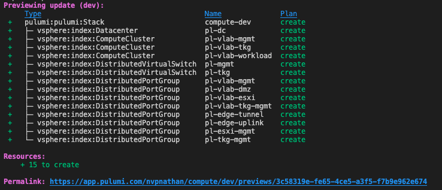
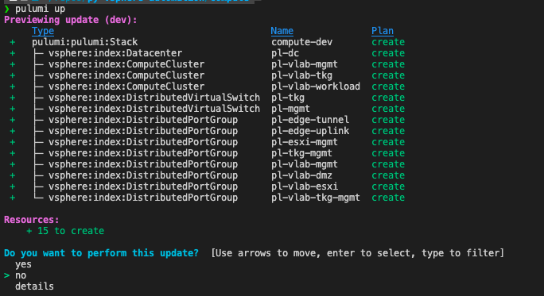
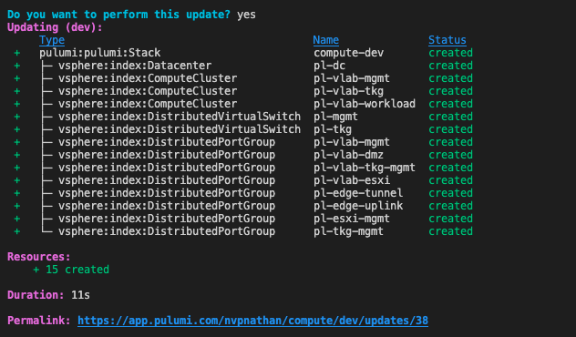

# Pulumi

### Overview
Pulumi is an open-source project that allows you to create/deploy/manage infra. as code in a variety of common programming languages. If you have used Terraform in the past, the jump to Pulumi will be minimal. Pulumi uses plugins as the shim to talk to the different Cloud Providers. I can't speak for all, but the vSphere plugin is derived from the Terraform provider. So any resource that's in the vSphere Terraform provider will be in Pulumi's vSphere plugin.
---

### Pre-req's:

Install Pulumi's CLI
```
brew install pulumi
```

Set config variables related to your environment
```
pulumi config set vsphere:allowUnverifiedSsl true
pulumi config set vsphere:password VMware1! --secret
pulumi config set vsphere:user administrator@vsphere.local
pulumi config set vsphere:vsphere_server vlab-vcsa.vballin.com
```

Create a new "stack" and install the "plugin" for vSphere.
```
pulumi new python
pulumi plugin install resource vsphere v2.2.1
```

That's it! You're ready to start "programming" your infratucture! I'm **slowly** learning python, so I thought this would be a great opportunity to continue learning on a ~~real-world~~ homelab usecase. 
---

## Usage:

The first thing you have to do is "import" the Pulumi Library's.
```python
import pulumi
import pulumi_vsphere

# Code Testing
#pulumi.runtime.settings._set_test_mode_enabled(True)  
```

Refer to the [docs](https://www.pulumi.com/docs/reference/pkg/vsphere/) site and start defining "Resources" in your programming language.

Once you have a Resource defined and are ready to test it you can use the Pulumi CLI.

`pulumi preview` is similar to `terraform plan`, it will evaluate your code and provide an output of Resources that will be add/changed/deleted/unchanged.
```
pulumi preview
```


If you are happy with the output and want to deploy it you can use `pulumi up`. This will again show you what's about to happen and you can confirm the change with `yes` or `no`.

Here's the preview of the `pulumi up` command
```
pulumi up
```


Once you confirm with `yes` you will see all the Resources in your code get created.

